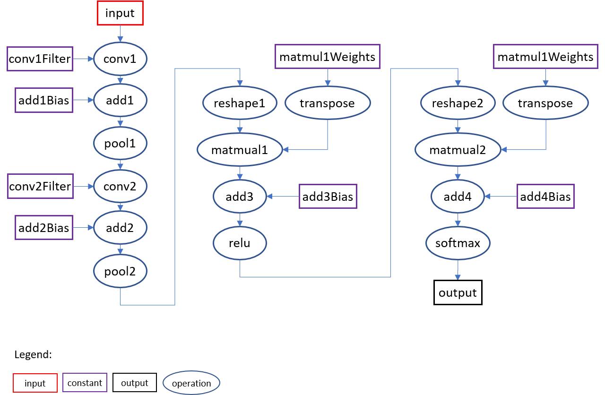
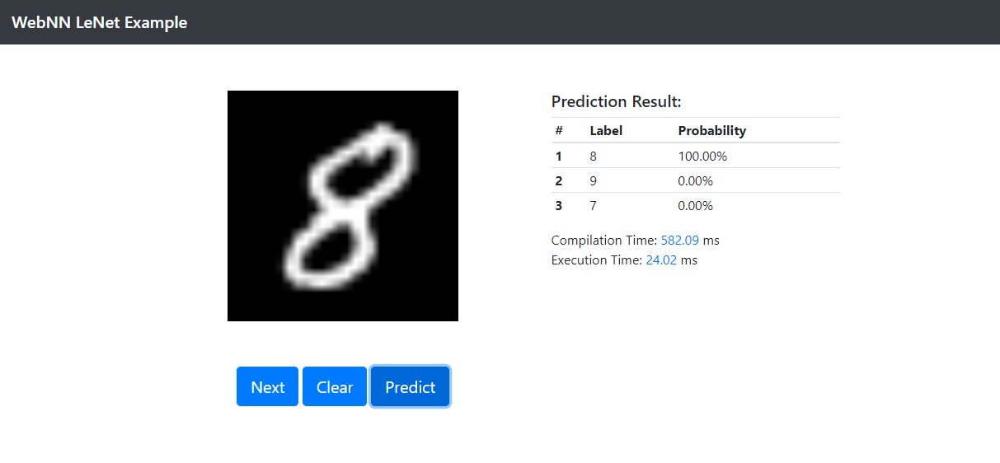
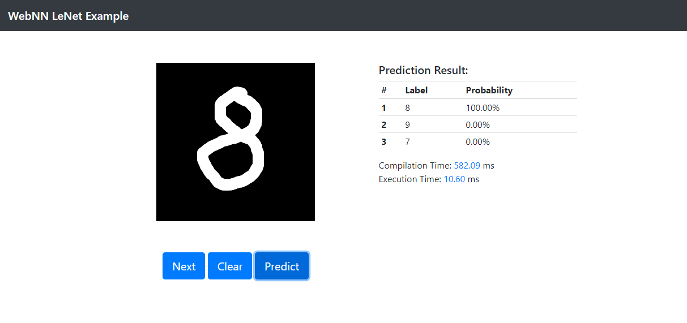

## WebNN API LeNet Example
This example showcases the [LeNet](http://yann.lecun.com/exdb/publis/pdf/lecun-01a.pdf)-based handwritten digits classification by WebNN API.

This example leverages the network topology of [the LeNet example of Caffe*](https://github.com/BVLC/caffe/tree/master/examples/mnist), the weights of [the LeNet example of OpenVINO*](https://github.com/openvinotoolkit/openvino/blob/master/inference-engine/samples/ngraph_function_creation_sample/) and the MNIST dataset of [mnist.js](https://github.com/cazala/mnist).

The following diagram illustrates the topology of [lenet.prototxt](https://github.com/BVLC/caffe/blob/master/examples/mnist/lenet.prototxt).

The following table lists the corresponding WebNN ops and parameters for each layer.

<table>
    <thead>
        <tr>
            <th>Layer (name:type)</th>
            <th>WebNN op</th>
            <th>Parameters</th>
        </tr>
    </thead>
    <tbody>
        <tr>
            <td rowspan=2>conv1: Convolution</td>
            <td>nn.conv2d</td>
            <td>input shape [1, 1, 28, 28], filter shape [20, 1, 5, 5], layout "nchw"</td>
        </tr>
        <tr>
            <td>nn.add</td>
            <td>bias shape [1, 20, 1, 1]</td>
        </tr>
        <tr>
            <td>pool1: Pooling</td>
            <td>nn.maxPool2d</td>
            <td>window shape [2, 2], strides [2, 2]</td>
        </tr>
        <tr>
            <td rowspan=2>conv2: Convolution</td>
            <td>nn.conv2d</td>
            <td>filter shape [50, 20, 5, 5], layout "nchw"</td>
        </tr>
        <tr>
            <td>nn.add</td>
            <td>bias shape [1, 50, 1, 1]</td>
        </tr>
        <tr>
            <td>pool2: Pooling</td>
            <td>nn.maxPool2d</td>
            <td>window shape [2, 2], strides [2, 2]</td>
        </tr>
        <tr>
            <td rowspan=2>ip1: InnerProduct</td>
            <td>nn.matmul</td>
            <td>transposed weights shape [800, 500]</td>
        </tr>
        <tr>
            <td>nn.add</td>
            <td>bias shape [1, 500]</td>
        </tr>
        <tr>
            <td>relu1: ReLU</td>
            <td>nn.relu</td>
            <td></td>
        </tr>
        <tr>
            <td rowspan=2>ip2: InnerProduct</td>
            <td>nn.matmul</td>
            <td>transposed weights shape [500, 10]</td>
        </tr>
        <tr>
            <td>nn.add</td>
            <td>bias shape [1, 10]</td>
        </tr>
        <tr>
            <td>prob: Softmax</td>
            <td>nn.softmax</td>
            <td>output shape [1, 10]</td>
        </tr>
    </tbody>
</table>

### Usage

Click the `Device` switch button to choose device preference for inference.

Click the `Predict` button to predict the digit shown in the canvas.

Click the `Next` button to pick up another digit from MNIST dataset.

Click the `Clear` button to clear the canvas and use mouse to draw a digit manually.

### Screenshots
Predict the MNIST digit

Predict the mannually drawing digit

